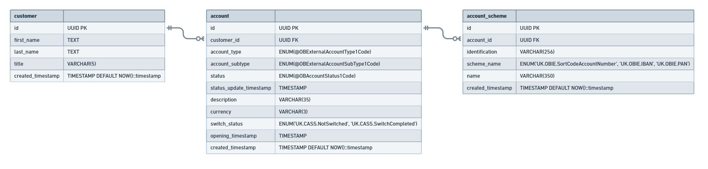

# Building a bank so Monzo will hire me

Over the next several months I'm going to learn Go and a bunch of cloud infrastructure stuff by building a banking app so Monzo will hire me.

I will make a ton of mistakes and bad judgement calls, but I'll leave it all in here as a complete history. We should celebrate our failures as normal growing pains.

## Architecture decisions

I imagine this will grow to include CQRS, micro-services, event streaming etc., but for now I've got a simple ERD and Postgres database. I'll scale it up as I go.

I don't have a balance on the account entity, I'm presuming that's a calculated value based on a transaction history. I'll figure out how to cache that or something later. The SQL schema I've written to implement this db is in the [./_assets/db.sql](./_assets/db.sql) file.
